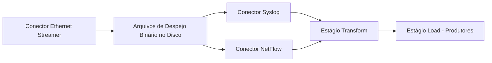

---
# snazzyDocs - DO NOT REMOVE OR EDIT BELOW THIS LINE
title: 'Ethernet Streamer'
id: 8CA-7W9Y-ISY-SM6
slug: ethernet-streamer
isVisible: true
lastUpdated: '2025-09-02 09:41:08'
---
# **<span align="center">Conector Ethernet Streamer</span>**

<br />

O **Conector Ethernet Streamer** age como um **ouvinte** para protocolos de rede, como **Syslog** e **NetFlow** (incluindo as variantes jFlow, NetStream e sFlow). Ao contrário de conectores como **SNMP, ICMP ou CSV**, que executam com base num agendamento ou intervalo configurado, o Ethernet Streamer é um **pipeline contínuo** que opera constantemente, monitorando o tráfego de entrada em tempo real.

Sua finalidade é capturar tráfego bruto no formato binário e despejá-lo num arquivo no disco local do servidor Viewtilog. Este conector **não decodifica nem analisa o tráfego** diretamente. Em vez disso, ele fornece um mecanismo de captura persistente para que outros conectores (ex., **Conector Syslog**, **Conector NetFlow**) possam, futuramente, ler esses despejos binários, decodificar o conteúdo e extrair os campos necessários. As etapas detalhadas de decodificação e extração de campos serão explicadas em seções subsequentes.

<br />

## **Principais Recursos**

-   Opera como um **ouvinte de tráfego** para os protocolos suportados.
-   Roda **constantemente**, diferentemente dos conectores agendados, assegurando assim que nenhum pacote seja perdido.
-   Captura pacotes no **formato binário** e os armazena num diretório predefinido.
-   Suporta **filtros do tipo tcpdump** para restringir a captura de tráfego por protocolo, porta ou host de origem/destino.
-   Permite a **ingestão de dados flexível e reutilizável**, já que os mesmos despejos binários podem ser processados por vários conectores.

<br />

## **Usando Filtros**

Os filtros são definidos empregando a **sintaxe tcpdump**, permitindo que os administradores controlem de maneira precisa o tráfego capturado. Isso garante que apenas fluxos relevantes sejam armazenados, minimizando o uso de disco e melhorando o desempenho.

<br />

#### **Exemplos de filtros tcpdump:**

<br />

-   Captura todos os pacotes direcionados à porta UDP **2055**, a porta padrão do NetFlow.
    
    ```bash
    port 2055
    ```
    
    <br />
    
-   Captura todos os pacotes associados ao **Syslog**, tipicamente enviados na porta UDP 514
    
    ```bash
    port 514
    ```
    
    <br />
    
-   Captura apenas pacotes NetFlow vindos do host 10.10.10.1 na porta 2055.
    
    ```bash
    host 10.10.10.1 and port 2055
    ```
    
    <br />
    
-   Captura tráfego NetFlow na porta 2055, mas apenas os vindos de 10.10.10.1, 10.10.10.2, ou 10.10.10.3.
    
    ```bash
    (host 10.10.10.1 or host 10.10.10.2 or host 10.10.10.3) and port 2055 
    ```
    
    <br />
    

## **Resumo**

<span align="justify">O Conector Ethernet Streamer representa o primeiro passo para o tratamento de dados baseados em fluxo e em log. Ele assegura uma captura de tráfego robusta em formato bruto, ao passo que a decodificação e extração de campos são tarefas delegadas para os conectores específicos das próximas fases do pipeline ETL.</span>

<span align="justify">O seu modelo de "ouvinte contínuo" assegura que nenhum pacote seja perdido, distinguindo-o de conectores agendados como SNMP, ICMP, ou CSV, os quais só operam num certo intervalo de tempo.</span>

<br />



<br />

## **Passo a Passo: Configurando o Conector Ethernet Streamer**

Siga estas etapas para configurar um **Conector Ethernet Streamer** no Estágio Extract:

1.  **Selecione o Conector Ethernet Streamer**
    
    -   Na janela _Editando o Estágio Extract_, abra a lista **Tipo de Conector/Streamer**.
    -   Escolha **Ethernet Streamer**.
        
        <br />
        
2.  **Atribua um Nome ao Pipeline**
    
    -   Insira um **nome exclusivo** para seu pipeline no campo _Nome do Pipeline_.
    -   Exemplo: `meu_pipeline_ethernet_streamer`.
    
    <br />
    
3.  **Selecione uma Interface de Rede**
    
    -   Na seção _Configuração do Streamer_, abra a lista suspensa **Interface**.
    -   Escolha a interface de rede que será usada para ouvir o tráfego recebido.
    -   Exemplo: `enp1s0f3` ou `enp68s0f0`.
        
        <br />
        
    
    <figure align="center"></figure>
    
    <figure align="center"></figure>
    
4.  **Defina um Filtro (opcional)**
    
    -   No campo _Filtro_, especifique um **filtro do tipo tcpdump** para capturar apenas o tráfego desejado.
    -   Exemplo:
        
        -   Capturar NetFlow de um único host:
            
            ```bash
            host 10.10.10.1 and port 2055
            ```
            
        -   Capturar todo o tráfego Syslog:
            
            ```bash
            port 514
            ```
            
    
    <br />
    
    <figure align="center"></figure>
    
5.  **Confirme a Configuração**
    
    -   Uma vez que a interface e o filtro estejam configurados, clique em **Confirmar** para salvar o pipeline.
    -   O pipeline começará agora a ouvir continuamente na interface selecionada.

<br />

## **Resultado**

O pipeline do Ethernet Streamer agora está ativo e capturando tráfego bruto da interface especificada. Os dados serão gravados em formato binário no disco e ficarão disponíveis para processamento por conectores de decodificação, como **Conector Syslog** ou **Conector NetFlow**, em etapas posteriores.

<br />
<br />

<br />

<br />
<br />

<br />