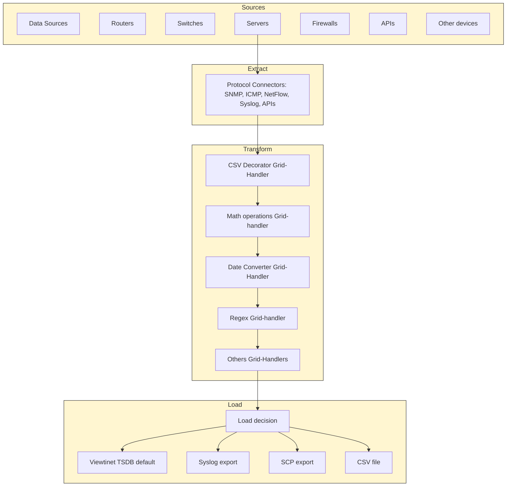

---
# snazzyDocs - DO NOT REMOVE OR EDIT BELOW THIS LINE
title: 'Introdução'
id: DCR-EHY-UBI-HN8
slug: intro
isVisible: true
lastUpdated: '2025-10-15 15:05:59'
---
# **Introdução**

 

## **Objetivo deste Manual**

Este manual explica como entender e operar o Visual Smart Data Broker (VSDB) dentro da plataforma Viewtinet. Ele apresenta o que é o VSDB, suas principais capacidades e como ele se encaixa na solução geral para que os administradores possam configurar pipelines de dados escaláveis e confiáveis para observabilidade.

##**Escopo**

Este capítulo cobre:

-   O que é o Visual Smart Data Broker.
-   Suas principais características e benefícios.
-   O papel do VSDB como a **engine de ETL** da plataforma Viewtinet.

(Configuração detalhada e operações avançadas são abordadas em capítulos posteriores.)

##**Público-Alvo**

-   Administradores de sistemas e da plataforma
-   Engenheiros de rede/observabilidade
-   Equipes de operações de TI/OT
-   Analistas de segurança/monitoramento

É recomendada uma compreensão básica de conceitos de redes, administração de Linux e protocolos comuns de telemetria/log.

##**O que é o Visual Smart Data Broker?**

O **Visual Smart Data Broker (VSDB)** é um componente central da Viewtinet que fornece uma **interface visual, sem código, para operações de ETL (Extract, Transform, Load)**.

-   **Extrair (Extract)**: Coleta dados de fontes heterogêneas através de ambientes TI, OT e IoT usando múltiplos protocolos e formatos (ex., logs, métricas, fluxos, APIs).
-   **Transformar (Transform)**: Normaliza, enriquece e estrutura registros brutos adicionando metadados, aplicando filtros e harmonizando esquemas.
-   **Carregar (Load)**: Direciona os dados processados e consistentes para os módulos da Viewtinet para armazenamento, dashboards, análises e alertas.

Ao configurar pipelines de ETL visualmente, os administradores podem definir como os dados são adquiridos, transformados e entregues sem escrever códigos ou consultas complexas.

Em resumo, o VSDB é a **engine de ETL da Viewtinet**: o ponto onde entradas brutas e díspares são transformadas em telemetria consistente e de alta qualidade, pronta para análise.

##**Recursos Principais**

-   **Pipelines ETL Visuais** 
    Construa e modifique fluxos de extração, transformação e carregamento através de uma interface intuitiva (UI).
-   **Extração de Múltiplas Fontes** 
    Conecte-se a diversos protocolos e fontes (SNMP, NetFlow, Syslog, Windows RM, APIs e mais).
-   **Transformação e Enriquecimento** 
    Padronize campos, enriqueça dados com contexto (tags, geolocalização, metadados de dispositivos) e aplique regras de filtragem.
-   **Carregamento e Roteamento** 
    Entregue conjuntos de dados estruturados aos módulos adequados da Viewtinet para armazenamento e análise.
-   **Retenção e Conformidade** 
    Aplique políticas de retenção e regras de governança para otimizar o armazenamento e garantir a conformidade.
-   **Escalabilidade e Resiliência** 
    Lide com fluxos de dados de alto volume através da escalabilidade horizontal.
-   **Transparência Operacional** 
    Forneça contadores, logs e ferramentas de monitoramento para validar a saúde da pipeline de ETL.
    
     
    

##**Entendendo o Ciclo de ETL com o Visual Smart Data Broker**

O diagrama acima ilustra como o **Visual Smart Data Broker (VSDB)** implementa o processo de ETL (Extract, Transform, Load) dentro da plataforma Viewtinet. Esse ciclo é a base de como dados brutos são convertidos em informações estruturadas e acionáveis.

### **1\. Fontes (Sources)**

Os dados podem vir de ambientes múltiplos e heterogêneos:

-   **Roteadores e switches** gerando registros de fluxo (flow records).
-   **Servidores** produzindo métricas de sistema e logs.
-   **Firewalls** exportando eventos de segurança.
-   **APIs** expondo conjuntos de dados externos.
-   **Outros dispositivos**, incluindo sensores IoT ou qualquer sistema capaz de produzir logs ou contadores.

Todos esses dispositivos fornecem informações para o sistema através de diferentes protocolos.

### **2\. Extração (Extract)**

A **etapa de Extração** usa **conectores de protocolo** para adquirir dados das fontes. 
Esses conectores suportam múltiplos protocolos como **SNMP, ICMP, NetFlow, Syslog, APIs**, e mais.

-   Os conectores atuam como a **camada de interface** entre os dispositivos e a plataforma.
-   Um único protocolo pode atender a diferentes tipos de dispositivos (ex., o SNMP funciona para roteadores, switches, servidores e firewalls).
-   O resultado desta etapa é a ingestão bruta de logs, contadores, eventos e fluxos no broker.

### **3\. Transformação (Transform)**

Uma vez que os dados são ingeridos, eles passam por um conjunto de **Grid Handlers** que executam operações de transformação em sequência. 
Cada tipo de handler executa uma função específica:

-   **Handler de parsing** → interpreta mensagens brutas e extrai os campos.
-   **Handler de normalização** → harmoniza os formatos em um esquema (schema) comum.
-   **Handler de operações matemáticas** → aplica cálculos ou agrega valores.
-   **Handler de mapeamento de dados** → remapeia campos para nomes ou estruturas padronizadas.
-   **Handler de enriquecimento** → adiciona contexto como tags, geolocalização ou metadados do dispositivo.

O objetivo desta etapa é transformar entradas brutas heterogêneas em **conjuntos de dados coerentes e enriquecidos** que estejam prontos para análise.

### **4\. Carregamento (Load)**

Finalmente, a **etapa de Carregamento** determina onde os dados processados serão armazenados ou exportados.

-   Por padrão, a informação é armazenada no **Viewtinet Time Series Database (TSDB)** para retenção de longo prazo e análises.
-   Alternativamente, os dados podem ser exportados para sistemas externos:
    
    -   **Exportação via Syslog** para integração com SIEMs ou ferramentas de log de terceiros.
    -   **Exportação via SCP** para transferir arquivos para outro servidor.
    -   **Exportação de arquivo CSV** para análise manual ou integração com fluxos de trabalho externos.

Esta etapa garante que os dados terminem no **lugar certo**, seja para visualização em dashboards, correlação com outros sistemas ou armazenamento externo.

---

## **Resumo**

O **ciclo ETL** no Visual Smart Data Broker fornece uma **abordagem flexível, visual e sem código** para integração de dados:

1.  **Extrair (Extract)** dados heterogêneos de qualquer dispositivo via conectores.
2.  **Transformar (Transform)** os dados através de Grid Handlers para parsing, normalização, cálculos, mapeamento e enriquecimento.
3.  **Carregar (Load)** as informações processadas no Viewtinet TSDB por padrão, ou exportá-las para sistemas externos.

Esse processo garante que fluxos de dados brutos e diversos se tornem **informações estruturadas, enriquecidas e acionáveis** por todo o ecossistema da Viewtinet.

 