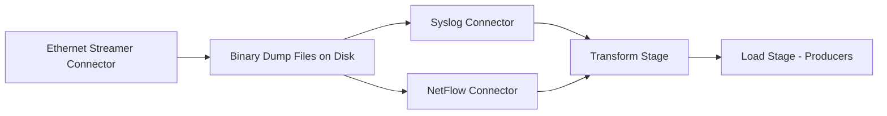

# **<span align="center">Ethernet Streamer Connector</span>**

<br />

The **Ethernet Streamer Connector** acts as a **listener** for network protocols such as **Syslog** and **NetFlow** (including variants like jFlow, NetStream, and sFlow). Unlike connectors such as **SNMP, ICMP, or CSV**, which execute based on a configured schedule or interval, the Ethernet Streamer is a **continuous pipeline** that runs constantly, listening for incoming traffic in real time.

Its purpose is to capture raw traffic in binary format and dump it into a file on the local disk of the Viewtilog server. This connector does **not decode or parse the traffic** directly. Instead, it provides a persistent capture mechanism so that other connectors (e.g., **Syslog Connector**, **NetFlow Connector**) can later read those binary dumps, decode the content, and extract the required fields. The detailed steps for decoding and extracting fields will be explained in subsequent sections.

<br />

## **Key Features**

-   Operates as a **traffic listener** for supported protocols.
-   Runs **constantly**, unlike scheduled connectors, to ensure no packet loss.
-   Captures packets in **binary format** and stores them in a predefined directory.
-   Supports **tcpdump-like filters** to restrict the traffic capture by protocol, port, or source/destination host.
-   Enables **flexible and reusable data ingestion**, as the same binary dumps can be processed by multiple connectors.

<br />

## **Using Filters**

Filters are defined using **tcpdump syntax**, enabling administrators to control precisely what traffic is captured. This ensures that only relevant flows are stored, reducing disk usage and improving performance.

<br />

#### **Examples of tcpdump filters:**

<br />

-   Captures all packets directed to UDP port **2055**, the default port for NetFlow.
    
    ```bash
    port 2055
    ```
    
    <br />
    
-   Captures all packets associated with **Syslog**, typically sent over UDP port 514
    
    ```bash
    port 514
    ```
    
    <br />
    
-   Captures only NetFlow packets from host 10.10.10.1 on port 2055.
    
    ```bash
    host 10.10.10.1 and port 2055
    ```
    
    <br />
    
-   Captures NetFlow traffic on port 2055, but only if it comes from 10.10.10.1, 10.10.10.2, or 10.10.10.3.
    
    ```bash
    (host 10.10.10.1 or host 10.10.10.2 or host 10.10.10.3) and port 2055 
    ```
    
    <br />
    

## **Summary**

<span align="justify">The Ethernet Streamer Connector is the first step in handling flow-based and log-based data. It ensures reliable traffic capture in raw format, while decoding and field extraction are delegated to specialized connectors in the next stages of the ETL pipeline.</span>

<span align="justify">Its continuous listener design guarantees that no packets are missed, differentiating it from scheduled connectors like SNMP, ICMP, or CSV that run only at specific intervals.</span>

<br />



<br />

## **Step-by-Step: Configuring the Ethernet Streamer Connector**

Follow these steps to configure an **Ethernet Streamer Connector** in the Extract stage:

1.  **Select the Ethernet Streamer Connector**
    
    -   In the _Editing Extract Stage_ window, open the **Connector/Streamer Type** list.
    -   Choose **Ethernet Streamer**.
        
        <br />
        
2.  **Assign a Pipeline Name**
    
    -   Enter a **unique name** for your pipeline in the _Pipeline Name_ field.
    -   Example: `my_ethernet_streamer_pipeline`.
    
    <br />
    
3.  **Select a Network Interface**
    
    -   In the _Streamer Config_ section, open the **Interface** dropdown.
    -   Choose the network interface that will be used to listen for incoming traffic.
    -   Example: `enp1s0f3` or `enp68s0f0`.
        
        <br />
        
    
    <figure align="center"></figure>
    
    <figure align="center"></figure>
    
4.  **Define a Filter (optional)**
    
    -   In the _Filter_ field, specify a **tcpdump-like filter** to capture only the desired traffic.
    -   Example:
        
        -   Capture NetFlow from a single host:
            
            ```bash
            host 10.10.10.1 and port 2055
            ```
            
        -   Capture all Syslog traffic:
            
            ```bash
            port 514
            ```
            
    
    <br />
    
    <figure align="center"></figure>
    
5.  **Confirm the Configuration**
    
    -   Once the interface and filter are configured, click **Confirm** to save the pipeline.
    -   The pipeline will now start listening continuously on the selected interface.

<br />

## **Result**

The Ethernet Streamer pipeline is now active and capturing raw traffic from the specified interface. The data will be written in binary format to disk and will be available for processing by decoding connectors such as **Syslog Connector** or **NetFlow Connector** in later stages.

<br />
<br />

<br />

<br />
<br />

<br />