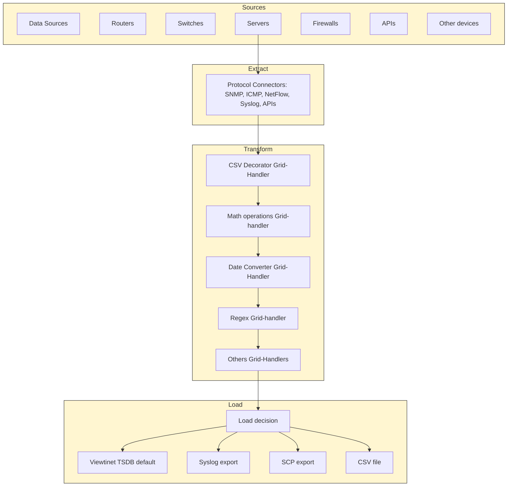

# **Introduction**

 

## **Purpose of this Manual**

This manual explains how to understand and operate the Visual Smart Data Broker (VSDB) within the Viewtinet platform. It introduces what VSDB is, its key capabilities, and how it fits in the overall solution so that administrators can configure reliable, scalable data pipelines for observability.

##**Scope**

This chapter covers:

-   What the Visual Smart Data Broker is.
-   Its main characteristics and benefits.
-   The role of VSDB as the **ETL engine** of the Viewtinet platform.

(Detailed configuration, and advanced operations are covered in later chapters.)

##**Target Audience**

-   System and platform administrators
-   Network/observability engineers
-   IT/OT operations teams
-   Security/monitoring analysts

A basic understanding of networking concepts, Linux administration, and common telemetry/logging protocols is recommended.

##**What is the Visual Smart Data Broker?**

The **Visual Smart Data Broker (VSDB)** is a core Viewtinet component that provides a **visual, no-code interface for ETL (Extract, Transform, Load)** operations.

-   **Extract**: Collects data from heterogeneous sources across IT, OT, and IoT environments using multiple protocols and formats (e.g., logs, metrics, flows, APIs).
-   **Transform**: Normalizes, enriches, and structures raw records by adding metadata, applying filters, and harmonizing schemas.
-   **Load**: Routes the processed and consistent data into Viewtinet modules for storage, dashboards, analytics, and alerting.

By configuring ETL pipelines visually, administrators can define how data is acquired, transformed, and delivered without writing complex code or queries.

In short, VSDB is the **ETL engine of Viewtinet**: the point where raw, disparate inputs are turned into consistent, high-quality telemetry ready for analysis.

##**Key Features**

-   **Visual ETL Pipelines** 
    Build and modify extraction, transformation, and loading flows through an intuitive UI.
-   **Multi-Source Extraction** 
    Connect to diverse sources and protocols (SNMP, NetFlow, Syslog, Windows RM, APIs, and more).
-   **Transformation & Enrichment** 
    Standardize fields, enrich data with context (tags, geolocation, device metadata), and apply filtering rules.
-   **Load & Routing** 
    Deliver structured datasets to the appropriate Viewtinet modules for storage and analysis.
-   **Retention & Governance Aware** 
    Apply retention policies and governance rules to optimize storage and ensure compliance.
-   **Scalability & Resilience** 
    Handle high-volume data streams with horizontal scalability.
-   **Operational Transparency** 
    Provide counters, logs, and monitoring tools to validate ETL pipeline health.
    
     
    

##**Understanding the ETL Cycle with Visual Smart Data Broker**

The diagram above illustrates how the **Visual Smart Data Broker (VSDB)** implements the ETL (Extract, Transform, Load) process within the Viewtinet platform. This cycle is the foundation of how raw data is converted into structured, actionable information.

### **1\. Sources**

Data can come from multiple and heterogeneous environments:

-   **Routers and switches** generating flow records.
-   **Servers** producing system metrics and logs.
-   **Firewalls** exporting security events.
-   **APIs** exposing external datasets.
-   **Other devices**, including IoT sensors or any system capable of producing logs or counters.

All these devices feed information into the system through different protocols.

### **2\. Extract**

The **Extract stage** uses **protocol connectors** to acquire data from the sources. 
These connectors support multiple protocols such as **SNMP, ICMP, NetFlow, Syslog, APIs**, and more.

-   Connectors act as the **interface layer** between devices and the platform.
-   A single protocol can serve different device types (e.g., SNMP works for routers, switches, servers, and firewalls).
-   The result of this stage is the raw ingestion of logs, counters, events, and flows into the broker.

### **3\. Transform**

Once data is ingested, it passes through a set of **Grid Handlers** that execute transformation operations in sequence. 
Each handler type performs a specific function:

-   **Parsing handler** → interprets raw messages and extracts fields.
-   **Normalization handler** → harmonizes formats into a common schema.
-   **Math operations handler** → applies calculations or aggregates values.
-   **Data mapping handler** → remaps fields into standardized names or structures.
-   **Enrichment handler** → adds context such as tags, geolocation, or device metadata.

The goal of this stage is to transform heterogeneous raw inputs into **coherent and enriched datasets** that are ready for analysis.

### **4\. Load**

Finally, the **Load stage** determines where the processed data will be stored or exported.

-   By default, information is stored in the **Viewtinet Time Series Database (TSDB)** for long-term retention and analytics.
-   Alternatively, data can be exported to external systems:
    
    -   **Syslog export** for integration with third-party SIEM or logging tools.
    -   **SCP export** for transferring files to another server.
    -   **CSV file** export for manual analysis or integration with external workflows.

This stage ensures that data ends up in the **right place**, either for visualization in dashboards, correlation with other systems, or external storage.

---

## **Summary**

The **ETL cycle** in the Visual Smart Data Broker provides a **flexible, visual, and no-code approach** to data integration:

1.  **Extract** heterogeneous data from any device via connectors.
2.  **Transform** the data through Grid Handlers for parsing, normalization, calculations, mapping, and enrichment.
3.  **Load** the processed information into the Viewtinet TSDB by default, or export it to external systems.

This process guarantees that raw and diverse data streams are turned into **structured, enriched, and actionable information** across the Viewtinet ecosystem.

 